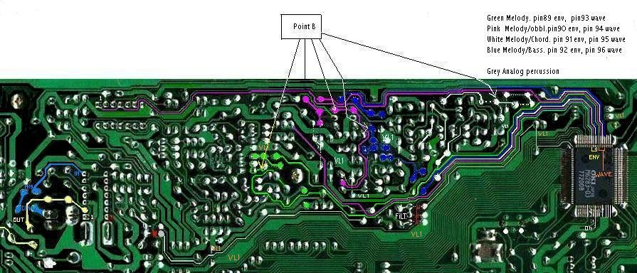

# Converted from: https://web.archive.org/web/20081204103543/http://www.electri-fire.com/sk1envelopcircuits.htm

### sk-1 envelop circuits 

The sound and envelop traces.

Point B is from the envelop schematic on page 8 of the [Concertmate 500/ SK1 servicemanual. ](../guides/casio-sk1-service-manual.pdf)

At point B is the sound BEFORE it has been through the envelope circuit. 

Electri-fire comments:

These circuitboards are wide, you may not entirely get them onscreen. Download and save if needed.

Making these has been a lot of work, reading schematics and following traces instantly turns me dyslexic. Unfortunately MsPaint blurred my carefully traced lines. I'm not doing this again, sorry. 

May these be of use for you benders and modders. Error reports are appreciated. 

The original circuitboard photograph was posted by bobinverted at Yahoo group "BendersAnonymous" at the Files/Boardscan section. Strangely a link to there doesn't work. 

We don't want to loose that fine piece of work. [Here's a backup. ](https://web.archive.org/web/20081204103543/http://www.electri-fire.com/sk-1/sk1pcb.jpg)

