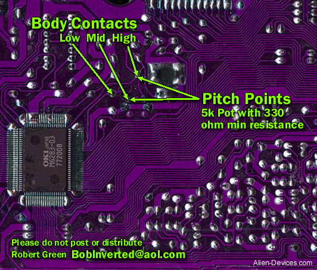
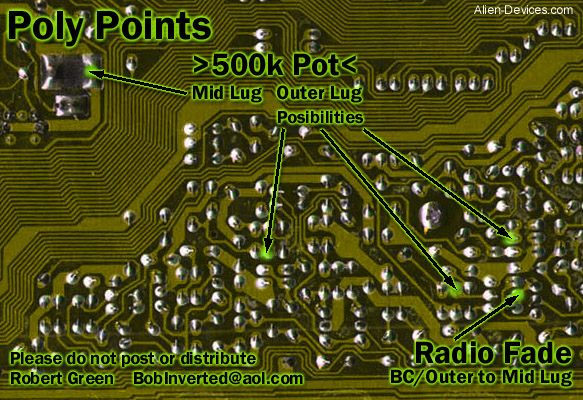

# Converted from: https://web.archive.org/web/20081204104128/http://www.electri-fire.com/bendormod.htm

### Bend or Mod? 

Some tech stuff / howzit work? 

Important: the sk-1 cpu has the logic signals lowered by 5 volts. This means a low is -5 volt, a high is 0 volt. 

  
In order to get the best bends you need to record a sample to fill the RAM's with data otherwise you get only boring 0's. 

The middle (-IC2) contains either the Demo or the Memory play data (not both) and some of the sample data. 

The other RAM (-IC1) contains sample data. 

Adress pins (A0-A12) are used to locate the data. The CPU sends -5 volt pulses to these, so connecting these to audio or envelope inputs gets you the loud clicks.   
Each RAM chip has eight I/O pins (duh..it's an 8-bit sampler) . 

For data to output pin 22 (OE = output enable) needs -5volt.   

**Selecting chips at the sk-1**

Page 11. The cpu uses a signal A15 (at cpu pin 30) to select between ROM and RAM. High (meaning 0 volt!) selects the ROM, low ( low is -5 volt!) selects RAM. 

  
As there are two RAM chips the sk-1 needs to select between the two. This is done by the A13 signal. The A15 and A13 signals both connect to IC3, the NAND gate chip TC74HC02 .  
The NAND chip translates the cpu high/low A13 signal (from cpu pin 27) and sends a high to the "chip enable" pin of the RAM of choice.   
The A15 high state overrules both A13 states so the cpu can select and acces the ROM.   
The cpu needs an undisturbed contact with the ROM containing instructions and data. Mess with this A15 signal and you are more likely to get crashes. 

This chip select scheme has a lot of bending potential.

Untested idea to make this more reliable: at IC3 we can cut loose A13 and insert a spdt switch to select two options: bent or original.   
NAND gate IC3 side at the middle lug, one side at original A13, cpu pin 30 (restoring unbent function), and other side at your choice of bend points to modulate between RAM 1 and RAM 2 at will. Manually with a switch, or with (preferably square) waves alternating between 0 and -5 volt. 

Audio works best when connected to IC3 through a diode or LED. The band on the diode indicating the + side must face away from IC3. The positive waveform parts will then be blocked. (remember 0V is considered a "high")

Some brainstorming involved here. I'm experimenting with these ideas but havn't reached a optimum way to implement all aspects. 

  
As the RAM's are "dynamic" , data in the RAM's need to be refreshed. To make this happen the cpu sends a high to RAM pin 1 , the "refresh enable". Not refreshing the RAM's would lead to your "highs" leaking away, soon turning into "lows".  
Should we leave the chip refresh pin undisturbed? It would seem best not connect pin 1 of the RAMs to anything when you want your sample to remain intact. However I've noticed sending it random signals (or audio!) deteriorates the data in unpredictable, but interesting ways. As some refresh cycles are skipped "1's" that have lost too much voltage turn into zero's. Your sample will progessively get more mangled. Not always in a pleasant way, but some noise terrorists aren't looking for "pleasant". 

The refresh pin reset

Another reset option! In some crashed states (drums stopped and a "static waveform") the refresh pin may work as a reset. When connected to 0V the sk-1 may restart the drumpattern and get out of the crash. This doesn't always work., but is the fastest reset I've encountered.   
  
So we can use three resets: in order of speed and depth we have:   
1: Refresh -fast, often works  
2: cpu reset -works most of the times  
3: Voltage disconnect: total restart - slowest, when in deep shit

The 

The audio lines

The sk-1 cpu has 5 audio output pins, that's one for percussion/drums, and, as the sk-1 is a 4-voice sampler it has four output pins for the waveforms. 

The four voices are sent through a 4066 quad switch into a choise of filter circuits. The 14 pin IC just right of my thumb in the above picture.

The control inputs of this ic (pin 6-7 and pin 12-13) are tied together two by two. I tried separate them to have four independent switches to the filters to use with control voltages, or insert audio for ringmod. I havn't been all that succesfull with these so far, maybe I haven't used the proper voltages, 

An usefull thing is partially bypass the filters by tapping the raw signals from the cpu and insert a 100k pot . Middle lug at cpu, left side at post filter amp input point, right side to ground. Can get LOUD now. Or off. 

12 jan. 2005 update: I'll keep the drums like above scheme and consider using Ghazala's POLY points for the other voices. A clear picture of these points and others by Robert Green were at [http://www.alien-devices.com/](https://web.archive.org/web/20081204104128/http://www.alien-devices.com/)

  
photos of poly- points, pitch and radio fade points at [http://www.alien-devices.com/](https://web.archive.org/web/20081204104128/http://www.alien-devices.com/)  

  
Tablebeast sk-1 bend tutorial at [http://sk-1.org/diy.htm](https://web.archive.org/web/20081204104128/http://sk-1.org/diy.htm)

Your sk-1 related link here? Send me a message through the guestbook.

  
