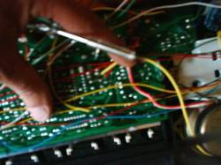
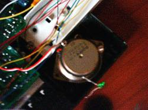
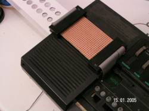
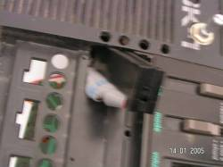
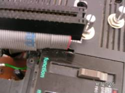
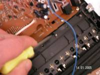
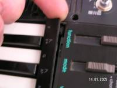
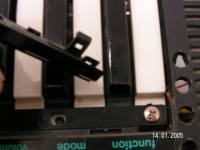

# Converted from: https://web.archive.org/web/20081204103753/http://www.electri-fire.com/sktarcircuitbentsk1.htm

### 

|  |  SK-tar : circuit bent Casio SK-1  History: This shows what I called the plectrum point.   At the thicker yellow wire near the index finger. I investigated the point with a LED inserted.  Touching certain points lights the LED. And mutes the sound.  Briefly scratching these points gives a scratching noisy attack sound.  Duhh.. you might think. But after the scratch the sk-1 continues and is differently filtered.  Or so it seems. Maybe I switched in a different waveform addres, I don't know. As a guitar player (more or less, my standard joke is I'm just feeding the effects), I'm used to this behaviour from a guitar string. (noise attack, gesture driven timbre variation) I found out later this plectrumpoint is the output from the poweramp. So the output is rectified and fed back to the cpu or memory chips.  A clearer view at this point can be seen at the [SK-1 Boardmarkings ](../guides/morePoints.md)page.     
To the right of the speaker an LED on a wire: It's my prototype plectrum.  The Strumplate I imagined making "strings" of metal rod, or a strum plate out of perfboard with copper traces.  I had some old computer flatcables with connectors that can directly attach on a circuit board. So the idea of using perfboard became very feasible. Here it is.    
  
  
Each connector has a 34 wire flatcable for double sided circuitboard.  Since I only use one side I connected a seventeen strip wide perfboard between two flatcables.  I've the cut the strips in two parts ( in a zigzag pattern ) and have 34 bendpoints very close together. I touch, strum and connect various bends with a plectrum I made out of copper plate .  As the plectrum is shaped or "scalloped" it can skip traces and make contact to a non adjacent trace.  Contacts can be made lengthwise along a trace, rejoining the cut between the two connectors, sideways joining traces on the same connector side, or use an "oblique strategy" to connect different traces between both connector sides. Also a short "strum" of momentary contacts between traces does interesting things.   (oops, this turned out too small I think..) Some of you may have had the experience of crashes "unlocking" with short contacts between points. These "unlock" bends aren't always the same points. When the SK-tar crashes I can often give it a couple of random whacks and get it started again.    
   
  
I made a hole for the connectors to pass through and a slit for the upper part of the flatcable. The rest of the flatcable passes between keys and the casing.   
I used the housing of a fluorecent lamp as a neck giving the thing a guitar like appearance.  To make room for the neck I replaced the stock speaker with a smaller one. At the neck I have two rows of switches. They are mostly momentary switches that connect to each other (several busses) and some switches that connect points to the plectrum (including the imfamous plectrumpoint that started this project). Yippeee!! I can strum and mute my SK-tar like a real guitar, often get out of crashes fast and in time with tempo, get a guitar like noise attack , tone color variations even when crashed. Playing the strumplate imposes a sens of rhytmic changes on the sound that free me from the harness of the fixed tempo Chord Mode. Get funky dude!  
  
I used a piece of chain to attach the plectrum . This turned out to be too unreliable a contact, so I connected it to a wire.  That is prone to breaking off. I will have to make one more reliable and replacable. (insert into a patch point)  Taking off the keys First remove the black strip with the note names. It's clicked into place and must be pried loose from down under. Then the screws are removed. The keys have small hook like extensions below them that protrude through the casing. Sk-1's are notourious for keys breaking off. If you want to do this move slowly and carefully.  
  
  
     
  
  

