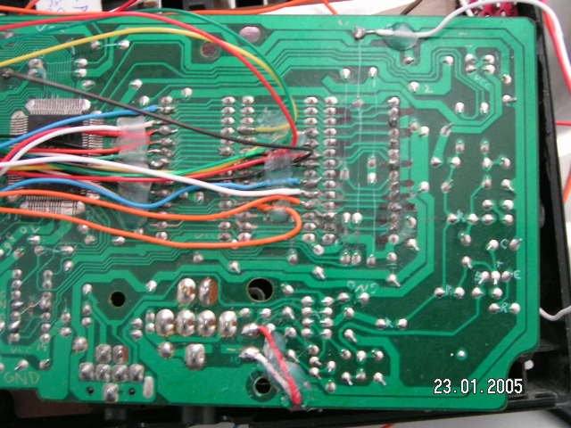
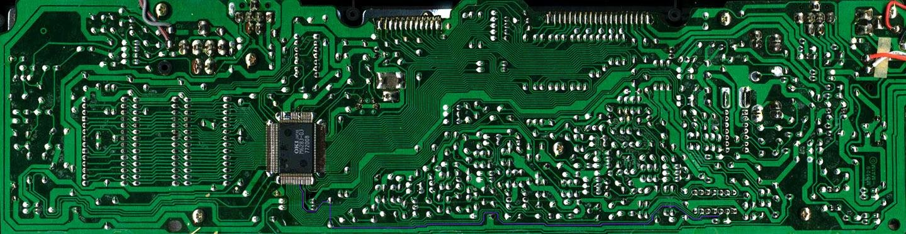
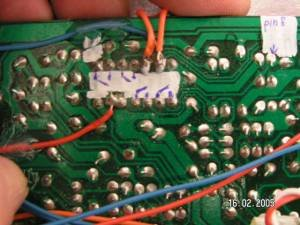
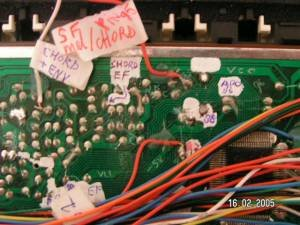

# Converted from: https://web.archive.org/web/20081204105120/http://www.electri-fire.com/sk1boardmarkings.htm

### sk-1 board markings 

More pics taken with points of interest marked. No time for proper tutorials, just check this out. Your milage may vary.

Some favorite electri/fire points. Marked in black: Tablebeast patchbay points . 

control signal for the 4066 quad switch IC.

The NAND gate chip with the ROM and RAM Chip Select lines. 

The lower marine line is for selecting the ROM. During that time the RAMs are deselected. 

The auto power off tutorial to be....

More messy stuff...

ß
