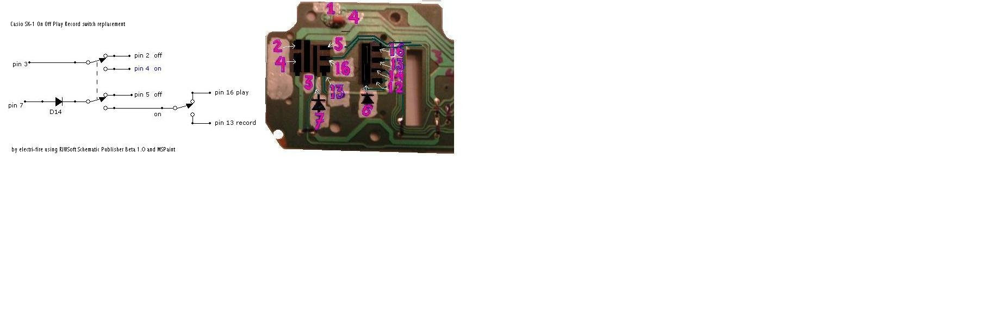

# Converted from: https://web.archive.org/web/20081204104601/http://www.electri-fire.com/sk1onoffplayrecord.htm

### Tips and Tricks section 

**sk-1**

**Replacing the on/play/record slider (and the Mode slider)**

1: parts needed: a double switch for on/off and (optional) a single switch to select play or record. (I've drawn some examples) 

2: remove the main circuitboard and switch circuitboard.

3: the on/play/record slider connects points on the 20 wire flatcable. Number 1 is at the speaker side. 

4: remove the slider or disconnect the wires from the flatcable. Some can be disconnected at the jumper wires at the back of the switchboard. 

5: Follow the diagram. Connect pin 7 to the switch AFTER the diode attached to it on the switch board. 

Remarks: 

I hardwired my racked MIDI sk-1 to play Mode only, omitting the play/record option. I used a dpdt switch for the on/off, and a direct connection after the diode at pin 7 to pin 16. 

I prefer soldering at the back of the switch circuitboard, but you can also use the same numbered points at the main circuitboard.

Except for pin 6 and 7 where you need to insert a diode. 

Mode switch (no pics yet) 

The normal/solo1/solo2/chord switch connects pin 6 to 16=normal, 13=solo1, 14=solo2, 12=chord. Again there's a diode between the mainboard and the switch board. 

I wouldn't want to use a 4way rotary, so I will probably omit the solo options and use a spdt to switch pin6 between pin16 and pin12. Be sure to insert the diode between pin6 and the switch. 

electri-fire comments:

Why would we want to do this? 

1: when your sliders are defective

2: when rehousing the sk-1

3: to make room for more bends. Provided you can do without the solo options, you can eliminate the circuitboard part pictured here by replacing it with 2 switches (or 3 with record option) and a 10K pot for volume.

This leaves space for more bends. Even when leaving the sliders and slider pot in place these can be used for bends. The 4-position switch is especially interesting.

The 10K slider pot used for bends gives more visual and tactile information where a rotary pot would do for volume. 

